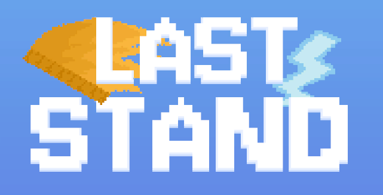
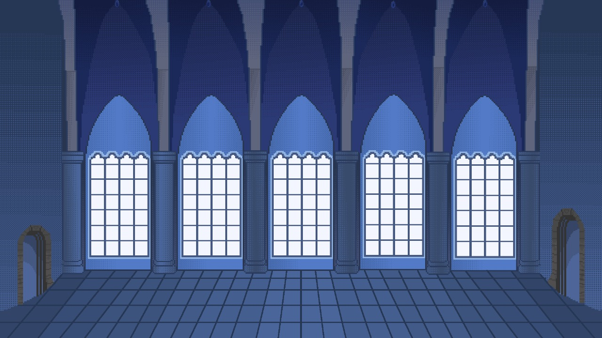
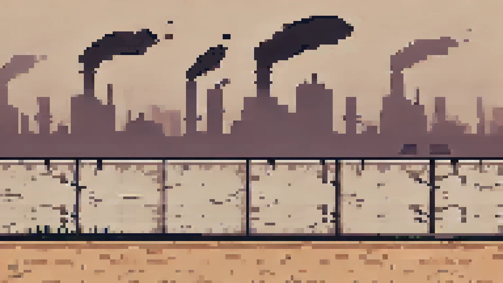

## 🤵 About Me
I’m a passionate developer with a strong interest in **Game Programming**, but I also love exploring new technologies!

Currently diving into :
- 🤖 Artificial Intelligence
- 🎮 Unity

Some things I’ve tried so far:
- 🎮 Many game projects with **Unity and C#**
- 🖥️ Developing Desktop Applications with **Tauri + Rust**  
- 🌐 Web Programming with **Go + React + gRPC**
- 📱 Mobile Apps Development with **Android Studio**

---

## 🚀 Featured Projects

<table>
  <tr>
    <td align="center" width="50%">
       
      <b>Last Stand</b> 
      🎮 A Unity-based pixelated game about fighting <i>Brain-rot</i> enemies with towers made by a professor. 
      <a href="https://github.com/MarcellSutiono/Last-Stand">🔗 View Repository</a>
    </td>
    <td align="center" width="50%">
       
      <b>Immortal Warrior</b> 
      ⚔️ A Unity-based 2D platform fighting game where you can dash and parry with your sword. 
      <a href="https://github.com/MarcellSutiono/Immortal-Warrior">🔗 View Repository</a>
    </td>
  </tr>
  <tr>
    <td align="center" width="100%">
       
      <b>Trash Catcher</b> 
      🎮 A Unity-based serious game about the importance of throw garbage in its place according to its type. 
      <a href="https://github.com/DEV4705/Trash_Catcher">🔗 View Repository</a>
    </td>
  </tr>
</table>

---

## 📫 Contact Me
- ✉️ Email : [marcell.sutiono@gmail.com](mailto:marcell.sutiono@gmail.com)  
- 💼 LinkedIn : [Marcell Sutiono](https://www.linkedin.com/in/marcell-sutiono-a76664310/)  
